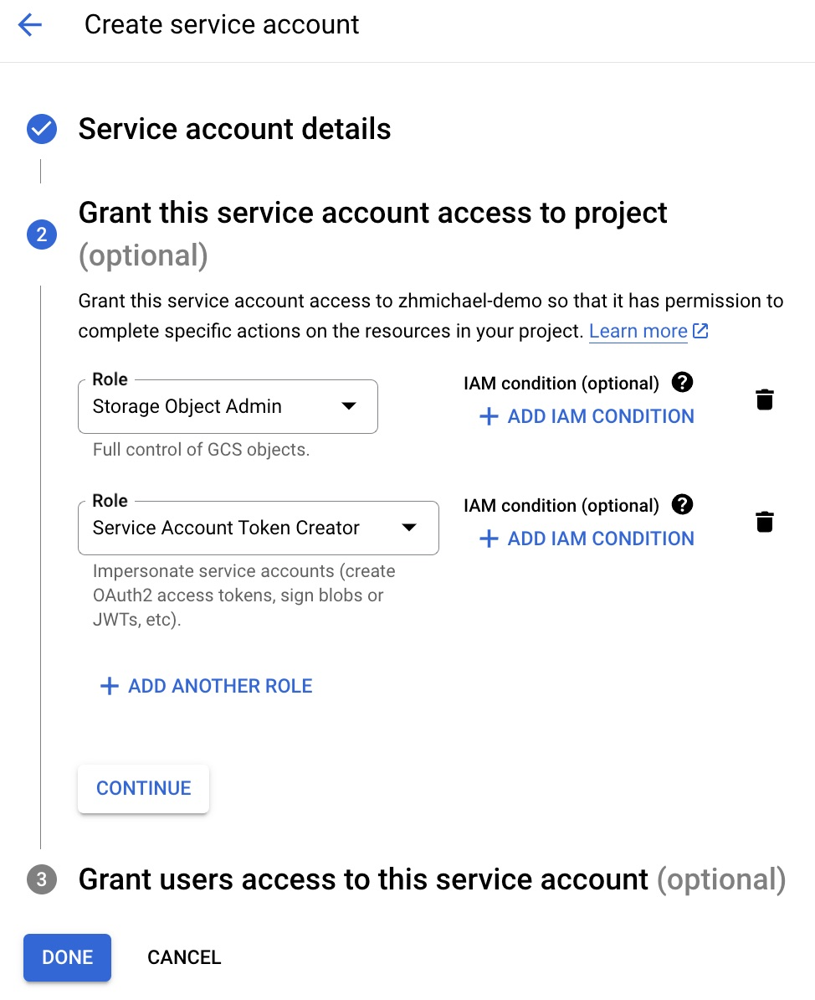
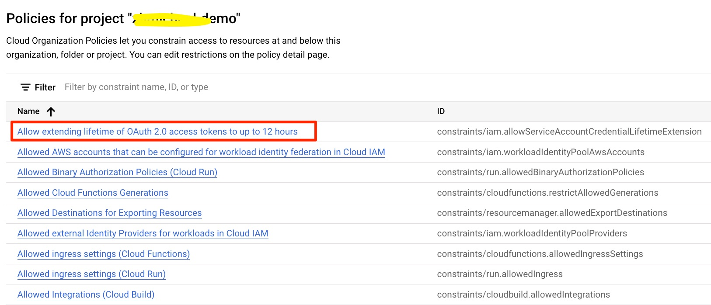
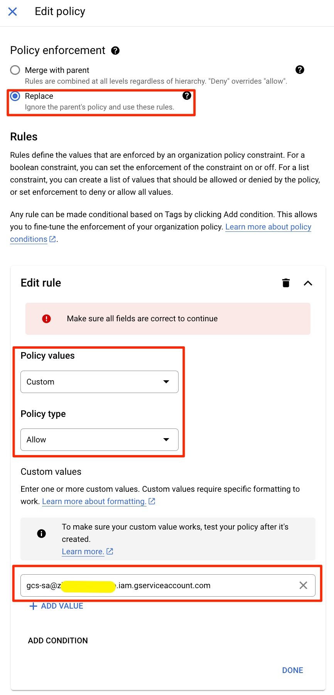
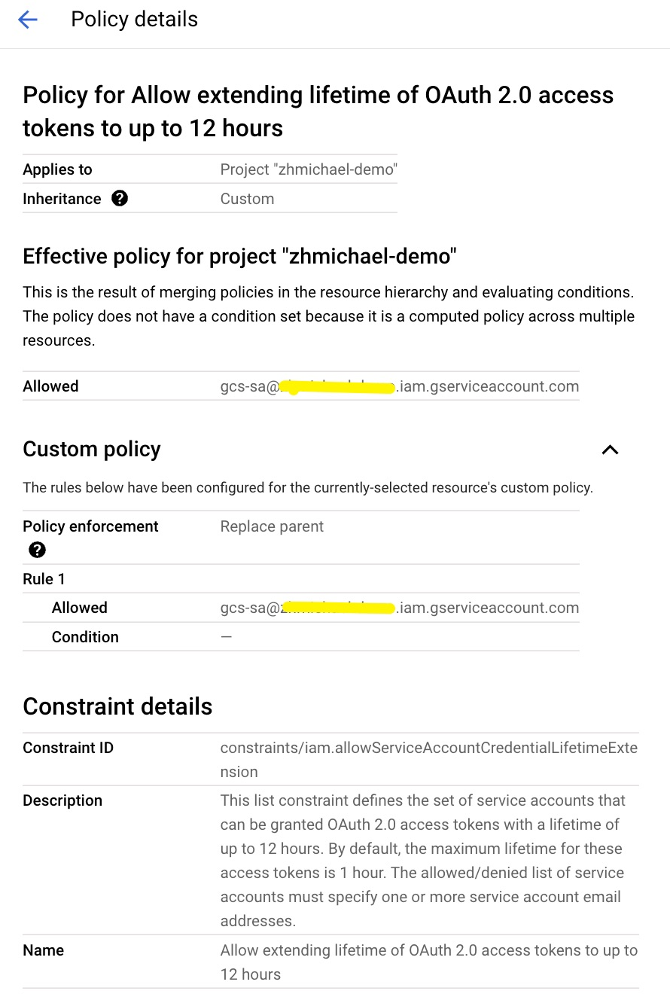
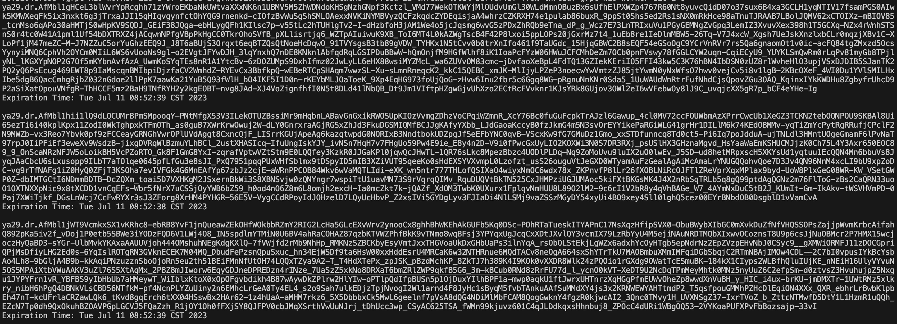
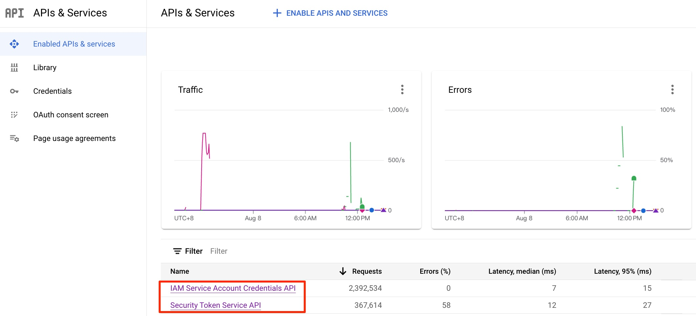

# access-boundary-access-token
This is a sample code demonstrate access boundary access token generation via the service account access token, and extend the token expiration time to 12 hours.


# Main Steps：
1. In Debian OS:
```
sudo apt install git maven -y
git clone https://github.com/zhmichael007/access-boundary-access-token.git
cd access-boundary-access-token
```
2. Create a Service Account, grant "Storage Object Admin" and "Service Account Token Creator" priviledge to it and dowanload a key file. Storage Object Admin ( roles/storage.objectAdmin ), Grants full control over objects, including listing, creating, viewing, and deleting objects.
  


3. Modify the organization policy "constraints/iam.allowServiceAccountCredentialLifetimeExtension" in "IAM->Organization policies", and set the service account name created in step 2 in this policy





You will get this display after saving this policy: 




4. Generate a key file from this service account, rename the service account key file to "gcs_sa_key.json" and put it to the same folder as pom.xml


5. Modify the Bucket name to your own in file AccessBoundaryTokenTest.java, this line: "String bucketName = "gcs-token";"

6. Compile and run the java code, you will see the output of the tokens each 5 seconds:
```
mvn compile
mvn exec:java -Dexec.mainClass=com.test.AccessBoundaryTokenTest
```



7. Get the access token from the output and try the curl command:

Upload a file via the access token and curl:
```
echo 'test' > demo.json
TOKEN="<access token>"
curl -X POST -T ./demo.json \
    -H "Authorization: Bearer $TOKEN" \
    "https://storage.googleapis.com/upload/storage/v1/b/<Your Bucket Name>/o?name=device1/1/2/3/test1/demo.json"
```

You will see the json output to show the upload is successful.

8. Test other folder priviledge:
try this command:
```
curl -X POST -T ./demo.json \
    -H "Authorization: Bearer $TOKEN" \
    "https://storage.googleapis.com/upload/storage/v1/b/<Your Bucket Name>/o?name=device1/1/2/4/test1/demo.json"
```

You will see the message:

"message": "xxx.iam.gserviceaccount.com does not have storage.objects.create access to the Google Cloud Storage object.


# Attention 
When generate the access token from the Service Account token, the boundary access token will inherit the expiration time from the Service Account token. And consider the IAM API quota, you'd better refresh the Service Account token intervally. In the sample code file AccessBoundaryTokenTest.java, I set a timer with 60s interval to refresh the Service Account access token.
```
timer.scheduleAtFixedRate(ServiceAccountTokenRefreshTask,
                Calendar.getInstance().getTime(),
                saTokenRefreshInterval);
```
1）the maximum expiration time is 12 hours

2）the token length is 2k

3）the restful API of GCS is POST method

# Quota Load Test
Need to promote the quota "IAM Service Account Credentials API->Generate credentials request per minute" and "Security Token Service API->Token exchange requests per minute" If you have a lot of clients need to obtain short-live credentials. 
Use AccessBoundaryTokenLoadTestSAToken.java for Service Account Token load test and AccessBoundaryTokenLoadTestSTS.java for STS token load test. Modify the main class in pom.xml. 

 

# Reference
IamCredentialsClient:
https://cloud.google.com/java/docs/reference/google-cloud-iamcredentials/latest/com.google.cloud.iam.credentials.v1

IAM storage related roles:
https://cloud.google.com/storage/docs/access-control/iam-roles

Restrict a credential's Cloud Storage permissions：
https://cloud.google.com/iam/docs/downscoping-short-lived-credentials

upload GCS file via token+restful:
https://cloud.google.com/storage/docs/uploading-objects

download GCS file via token+restful:
https://cloud.google.com/storage/docs/downloading-object


